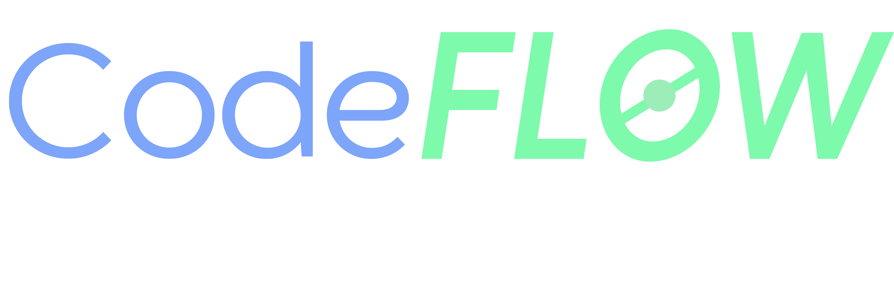

<h3> *Este é um projeto desenvolvido como avaliação individual final do módulo Programação Orientada a Objetos I do curso de backend em C# da AdaTech em parceria com o Mercado Eletrônico. </h3>

<h3>CodeFlow é um aplicativo desktop para gerenciamento de equipes de desenvolvimento de software, onde um TechLeader coordena diversas equipes :)</h3>

## Table of Contents

- [Como usar](#como-usar)
- [Design](#design)
- [Documentação](#documentação)
- [Autenticação](#autenticação)
- [Database](#database)
- [Estrutura do projeto](#estrutura-do-projeto)
- [Funcionalidades](#funcionalidades)
- [Páginas e Flow](#páginas-e-flow)

## Como usar

- Baixe e instale a fonte Ubuntu do Google Fonts.
- Clone o repositório e defina o projeto UI como startup project.
Agora o projeto está pronto para ser executado.

## Design

O design desta aplicação foi desenvolvido no figma e está disponível para consulta aqui. Entretanto, não foi possível replicar o design inteiramente devido às limitações do windows forms.
O design do logotipo e do ícone foram desenvolvidos no Illustrator e utilizado em todas as páginas da aplicação. Alguns ícones (como o de botão home) foram importados do banco de ícones do React, outros foram desenvolvidos no figma e importados como png.

## Documentação

## Autenticação

Este projeto possui dois tipos de usuários: TechLeader e Developer. Ambos podem criar suas próprias contas e logo após utilizar a aplicação normalmente.

Apenas o TechLeader pode criar um projeto e para um developer entrar no projeto é preciso que ele seja convidado e que ele entre no projeto com o código do projeto.

## Database
Este projeto utiliza [SQLite]([https://www.sqlite.org/index.html) como banco de dados. 

## Estrutura do projeto

A solution foi dividida em duas partes: UI (a interface) e Backend (lógica de negócio).
Dentro do backend, o projeto foi divido entre services e repositories. UI faz solicitações com DTOs (se necessário) para o Service correspondente e o Service chama um (ou vários) métodos do Repository correspondente (que pode devolver uma Entity). 

## Funcionalidades

<h3>TechLeader</h3>

- Criar projeto
- Criar Task
- Atualizar os detalhes de um projeto, como sua data de entrega
- Atribuir Task a algum developer
- Convidar Developer para um projeto
- Remover um developer de um projeto
- Alterar uma Task
- Definir uma data para uma Task criada por Developer e consequentemente liberar ela para desenvolvimento
- Visualizar todas as Tasks de um projeto
- Criar TAG
- Definir uma TAG como done
- Ver a quantidade de tasks em cada status
- Ver a quantidade de projetos em cada status
- Atualizar as suas informações 

<h3>Developer</h3>

- Entrar em um projeto na qual foi convidado
- Criar Task (porém ela será atribuída a o próprio developer e só ficará disponível para modificações de progresso após o TechLeader do projeto definir uma data)
- Criar TAG
- Ao completar toda a checklist de uma Task, enviar para review do tech leader
- Visualizar todas as suas próprias tasks do projeto e as Tasks que tem as mesmas tags que as suas tasks
- Atualizar suas informações 

## Páginas e Flow

<h3>Página de login</h3>

Cadastro contém perguntas em comum e uma pergunta específica de acordo com o seu papel.

<h3>Home page</h3>

É possível visualizar todos os projetos em que você está participando e algumas estatísticas no canto superior direito: quantidade projetos em cada status. Disponível para todos os usuários. 
- O botão + leva à página de criar projeto, caso você seja tech leader.
- Caso seja Developer, leva à página de entrar em um projeto.
- Cada card de projeto é um botão para abrir o board de cada projeto.
- O botão no canto superior direito leva à página de perfil.
- Status do projeto: on going (possui tasks sendo desenvolvidas), open (não possui tasks ainda ou nenhuma delas foi iniciada), late (data de entrega está no passado), done (todas as tarefas foram concluídas), canceled (projeto foi cancelado pelo tech leader, neste caso o card do projeto não possui mais uma funcionalidade ao clicar).
  

<h3>Criar Projeto</h3>

Todos os campos são obrigatórios e não é possível adicionar uma data no passado. Não é póssível criar um projeto com o mesmo nome de um projeto seu já existente. Página disponível apenas para Tech Leaders.

<h3>Board de Projeto</h3>

É possível visualizar todas as tasks do projeto. Página disponível para todos os usuários.
- Os dois botões no canto superior direito só ficam visíveis quando o usuário é Tech Leader.
- O botão de configurações leva à página de Configurações do projeto
- O botão de adicionar participantes leva à página de convidar a um projeto
- O botão add task está disponivel para todos e leva à página de adicionar task
- É possível ver o progresso do projeto no canto inferior esquerdo (quantidade de tasks em cada estado) e no canto inferior direito (porcentagem de tasks completas)
- Quando um developer conclui uma task, ela vai para a aba de Review onde o tech leader pode avaliar se coloca em done ou não
- Quando o tech leader conclui uma task, ela vai para a aba de done
- Caso você seja um developer, apenas as suas tasks e as tasks com as mesmas tags que as suas tasks são visíveis
  

- Ao adicionar uma task, ela tem seu status setado como open
- Cada task é um botão que leva a página de task específica
  

<h3>Criar task</h3>

Criação de task. Página disponível para todos os usuários.
- Caso o usuário seja Developer, o campo assignee estará por default com o username do próprio usuário e não será possível mudar. O campo due date não pode ser definido por um developer.
- Caso o usuário seja Tech Leader, o campo assignee pode receber o username de qualquer usuário que está no projeto.
- Existe um banco de tags para cada projeto, que mostram relação entre as tarefas. Qualquer usuário pode criar uma nova tag ou utilizar uma existente na sua task.
- É possível criar uma checklist de atividades dentro da task. Caso isso seja feito, a mudança de status da tasks será feita automáticamente.

- Task criada por developer com data ainda não definida:

  
<h3>Task específica</h3>

É possível alterar a task. Página disponível para todos os usuários.
- Caso você seja developer, não é possível atualizar o campo assignee ou due date.
- Quando os itens do checklist são marcados ou desmarcados, o status da task é alterado -> nenhum item marcado tem status open, alguns itens marcados tem status in progress, todos os itens marcados tem status done se o usuário for tech leader e tem sattus review se o usuário for developer.
- O botão em formato de casa leva à página de board de projeto
- Também é possível alterar o status manualmente

- Ao alterar o checklist da task o status do projeto também foi atualizado:
  

<h3>Convidar para um projeto</h3>

Página para convidar um developer ao projeto. Cada projeto tem um código específico para entrar no projeto. É preciso que o tech leader convide um developer através do seu username antes para que ele possa entrar no projeto depois. Ao convidar um developer para um projeto, foi planejado enviar um email com o código do projeto porém não houve tempo hábil para implementar essa funcionalidade. 

<h3>Perfil</h3>

É possível atualizar informações, exceto username e especialização (para tech leader). Página disponível para todos os usuários. 

<h3>Entrar em um projeto</h3>

